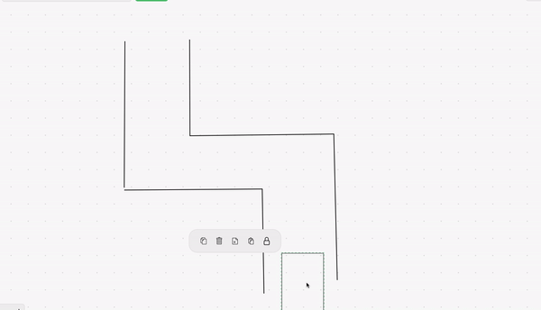

# Those who are stalking me lol
This is pretty bad code. I remember writing all of this during COVID and didn't really have access to many sensor equipments or physical hardware. I would recommend tackling this problem with a LIDAR sensor because its so much better. Also V-SLAM is another technique that is popular in combo with the LIDAR. If you want to see some actual good autonomous routine code you should definitely check out 612 repo.

# AutoDrive
This code will "theoretically" solve any maze using sensors and different algorithms.

# auto_routine_1
This routine uses one ultrasonic sensor and one gyroscope. In "theory" the robot should constantly be moving forward until it is close to an object(a wall in the maze). If it does detect a wall, it will then rotate and move forward in a straight line with some P loop tuning utilizing the gyroscopes. The process continues to keep running until it exits the maze.

# auto_routine_2
still under construction I am currently thinking of using the mecanum wheels to strafe and see how that goes(I might need more sensor for that).
Since you cannot see it here is a gif for you visual people. :)

